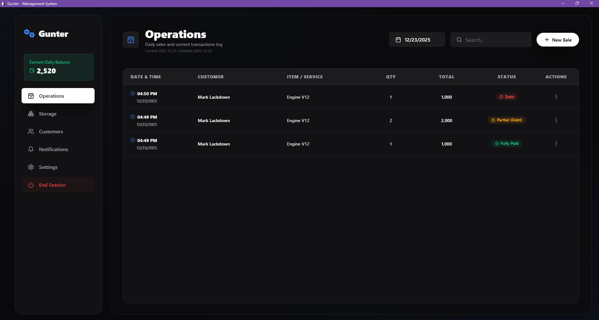
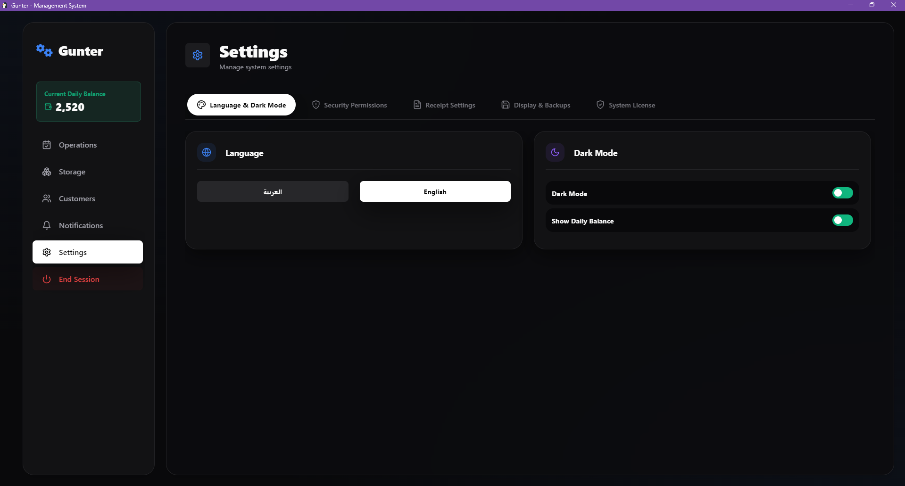

# 🛠️ Gunter Management System

<p align="center">
  
</p>

<p align="center">
  
  
  
  
</p>

---

### 🌟 Overview

**Gunter** is a premium workshop management solution designed for modern mechanical businesses and spare part stores. It combines a state-of-the-art user interface with robust security and real-time cloud synchronization.

<p align="center">
  
</p>

---

### 🚀 Key Features

| Feature | Description |
| :--- | :--- |
| **🌍 Multi-language** | Seamless toggle between **Arabic** and **English** with full RTL support. |
| **📈 Operations Hub** | Real-time tracking of sales, payments, and debts with detailed history. |
| **📦 Smart Inventory** | Automated stock monitoring with low-inventory alerts and threshold management. |
| **👥 CRM** | Centralized customer database with transaction logs and balance tracking. |
| **🧾 Professional Receipts** | Customizable thermal receipt printing for every transaction. |
| **🔒 Advanced Security** | Tiered access control (User/Admin) and encrypted background license validation. |
| **☁️ Firestore Sync** | Real-time backup and cloud synchronization for license keys and system control. |

---

### 🛠️ Tech Stack

- **Frontend:** React 18 & Vite
- **Desktop Wrapper:** Electron
- **Backend/DB:** Firebase Firestore & Auth
- **Styling:** Modern Vanilla CSS (Glassmorphism & Variables)
- **Icons:** Lucide-React

---

### 📦 Installation & Build

#### Dev Environment
```bash
# Clone the repo
git clone https://github.com/TemRevil/gunter.git

# Install dependencies
npm install

# Run Dev Server
npm run dev

# Run Electron
npm run electron
```

#### Production Build
```bash
# Build the application
npm run electron:build
```
*Note: The production executable is generated in the `release/win-unpacked` directory.*

---

### �️ Security & Licensing

The system features an enterprise-grade licensing layer:
- **Auto-Login**: Transparent administrative authentication for database safety.
- **One-Time Activation**: Unique hardware-linked keys validated via Firestore.
- **Role Permissions**: Sensitive actions (deletion, settings) require administrative override.

---

<p align="center">
  <i>Developed with ❤️ by <a href="https://temrevil.github.io/revil">Tem Revil</a> using Antigravity.</i>
</p>
